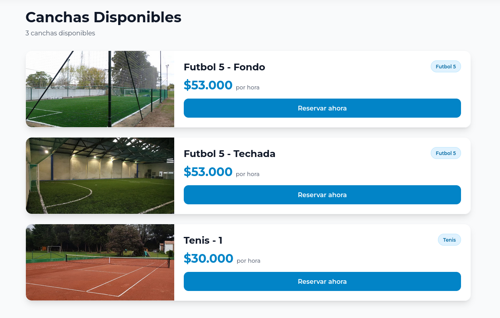
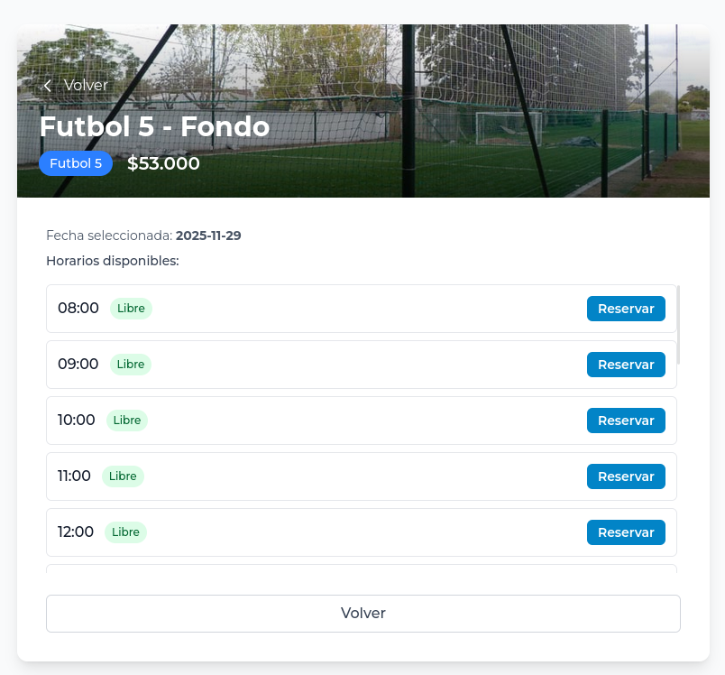

# Alquiler de Canchas

Este es un sistema para administrar un club deportivo. Como usuario, se puede ver qué canchas tiene el club, consultar la disponibilidad de una cancha en una fecha específica, y realizar y cancelar reservas. Como administrador, se puede agregar, modificar y quitar canchas y reservas manualmente, además de administrar a los usuarios que tienen acceso. Se puede acceder a una versión deployada del sistema [acá](https://alquiler-de-canchas-bbdd.onrender.com/).

<div style="display: flex; flex-direction: column; align-items: center; gap: 20px;">
  
  
</div>

## Para desarrollo en local:

Como runtime, usamos [bun](https://bun.com/), una alternativa general a Node. El proyecto fue desarrollado con el mismo. 

### Backend `cd backend`:
Instalar dependencias
```bash
bun install
```

Duplicar ```.env.example``` y renombrar a ```.env```:
```bash
cp .env.example .env
```

Correr el contenedor para la base de datos:
```bash
docker compose up -d
```

Y el server:
```bash
bun dev
```


### Frontend `cd frontend`
Instalar dependencias
```bash
bun install
```
Duplicar ```.env.example``` y renombrar a ```.env```:
```bash
cp .env.example .env
```

Correr el front
```bash
bun dev
```
